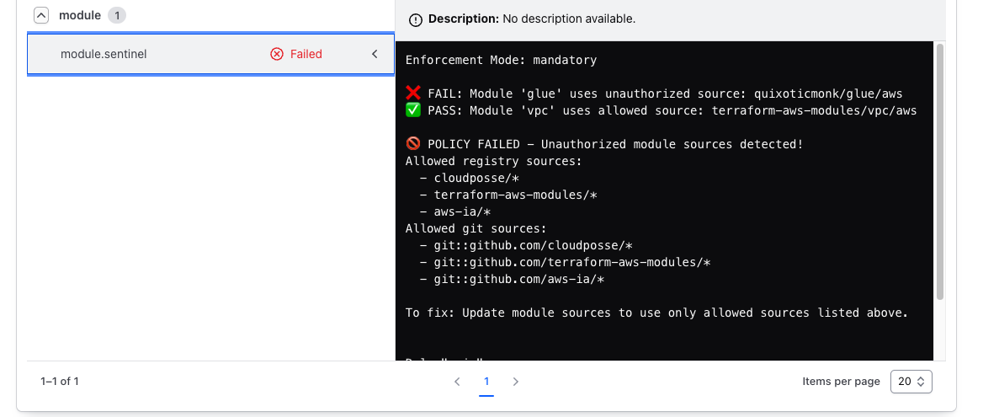

# Module Origin Validator [work in progress]

Policies to validate Terraform module sources across multiple policy engines.

## Configuration

Edit `allowed-sources.yaml` to customize allowed module sources:

```yaml
allowed_sources:
  registry:
    - "cloudposse/*"
    - "terraform-aws-modules/*" 
    - "aws-ia/*"
  git:
    - "github.com/cloudposse/*"
    - "github.com/terraform-aws-modules/*"
    - "github.com/aws-ia/*"
```

## Usage

### Sentinel (HCP Terraform)
The Sentinel policy validates module sources in HCP Terraform runs:



```hcl
# sentinel.hcl
policy "module-source-policy" {
    source = "./module-source-policy.sentinel"
    enforcement_level = "hard-mandatory"
}
```

### Checkov
```bash
# Run specific check
checkov -f main.tf --external-checks-dir checkov/ --check CKV_TF_MODULE_SOURCE

# Run all checks (includes custom check)
checkov -f main.tf --external-checks-dir checkov/
```

### Pre-commit
Add to `.pre-commit-config.yaml`:
```yaml
repos:
  - repo: local
    hooks:
      - id: validate-module-sources
        name: Validate module sources
        entry: ./pre-commit/validate-module-sources.sh
        language: script
        files: \.tf$
```

## Examples

- `examples/pass/pass.tf` - Module sources that should pass validation
- `examples/fail/fail.tf` - Module sources that should fail validation
